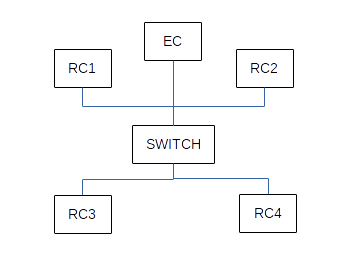

# Bash Experiment Orchestration Framework (BEOF)

BEOF, similar to [Orbit Management Framework (OMF)](http://www.winlab.rutgers.edu/docs/focus/GENI-OMF.html), is a framework used to orchestrate messages between computer resources. Messages will originate from an Experiment Controller (EC) and they are consumed by one or more Resource Controllers (RCs). RCs send Acknowledgments (and results) back to the EC. The framework is built using the Bourne Again SHell (BASH) scripting language.


## preparation

- BEOF only works in Debian and Ubuntu Linux distributions. Make sure your system meets this requirement.

- As a quick way to check the operation of BEOF, we will set-up 5 nodes (1 EC node and 4 RC nodes) using docker instances.

- First, build a docker image using the Dockerfile (i.e. [Dockerfile_BEOF](config/Dockerfile_BEOF)) provided.
```bash
docker build -t beof -f Dockerfile_BEOF .
```

- Next, create 5 containers of the docker image.
```bash
docker run -it --name EC  -v DataVolume1:/root/BEOF/config -v DataVolume2:/root/BEOF/exec -v DataVolume3:/root/BEOF/tmp --hostname=EC  beof
docker run -it --name RC1 --volumes-from EC --hostname=RC1 beof
docker run -it --name RC2 --volumes-from EC --hostname=RC2 beof
docker run -it --name RC3 --volumes-from EC --hostname=RC3 beof
docker run -it --name RC4 --volumes-from EC --hostname=RC4 beof
```

- The resources will be used to build a ping request/reply scenario as shown below


- Note down the control IP addresses of the EC node and RC nodes.
```bash
hostname -i
```

- From the EC node, edit [ping_test.sh](expr_descr/ping_test.sh) script and update control IP address variables (i.e. HOST_EC, RC1_CTRL_IP, RC2_CTRL_IP, RC3_CTRL_IP, RC4_CTRL_IP).
```bash
nano /root/BEOF/expr_descr/ping_test.sh
```

- Finally, execute [ping_test.sh](expr_descr/ping_test.sh).
```bash
/root/BEOF/expr_descr/ping_test.sh
```

-  If everything works properly, you should get an output similar to the following
```bash
PING 172.17.0.3 (172.17.0.3) 56(84) bytes of data.
PING 172.17.0.4 (172.17.0.4) 56(84) bytes of data.
PING 172.17.0.5 (172.17.0.5) 56(84) bytes of data.
PING 172.17.0.6 (172.17.0.6) 56(84) bytes of data.
64 bytes from 172.17.0.3: icmp_seq=1 ttl=64 time=0.088 ms
64 bytes from 172.17.0.4: icmp_seq=1 ttl=64 time=0.123 ms
64 bytes from 172.17.0.5: icmp_seq=1 ttl=64 time=0.120 ms
64 bytes from 172.17.0.6: icmp_seq=1 ttl=64 time=0.164 ms
64 bytes from 172.17.0.3: icmp_seq=2 ttl=64 time=0.083 ms
64 bytes from 172.17.0.4: icmp_seq=2 ttl=64 time=0.087 ms
64 bytes from 172.17.0.5: icmp_seq=2 ttl=64 time=0.081 ms
64 bytes from 172.17.0.6: icmp_seq=2 ttl=64 time=0.101 ms

--- 172.17.0.3 ping statistics ---
3 packets transmitted, 3 received, 0% packet loss, time 2026ms
rtt min/avg/max/mdev = 0.083/0.087/0.090/0.003 ms

--- 172.17.0.4 ping statistics ---
2 packets transmitted, 2 received, 0% packet loss, time 1030ms
rtt min/avg/max/mdev = 0.087/0.105/0.123/0.018 ms

--- 172.17.0.5 ping statistics ---
2 packets transmitted, 2 received, 0% packet loss, time 1031ms
rtt min/avg/max/mdev = 0.081/0.100/0.120/0.021 ms

--- 172.17.0.6 ping statistics ---
2 packets transmitted, 2 received, 0% packet loss, time 1000ms
rtt min/avg/max/mdev = 0.101/0.132/0.164/0.033 ms
```

## BEOF Specifics

- Current implementation orchestrates messages within a single broadcast domain.


## Author

Michael Tetemke Mehari
michael.mehari@ugent.be

